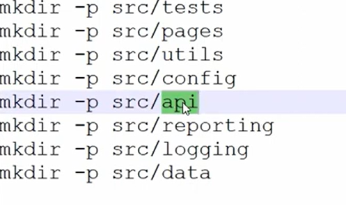

# Playwright Enterprise level test automation framework

installation:
```bash
npm install playwright
```

once intallation done created below folder structure open terminal and run the below command to create the folder structure.

as you have created special folder for testcases you need to add that path in the config file under testDir property.
```js
export default defineConfig({
  testDir: '.src/tests',
})
```
### Encryprtion and Decryption of files
Need to install crypto-js package to encrypt and decrypt the files. Below is the command to install the package.
```bash
npm install crypto-js
npm install --save-dev @types/crypto-js
```
### Faker to generate random data
Need to install faker package to generate random data. Below is the command to install the package.
```bash
npm install --save-dev @faker-js/faker
```
To use it in script you need to import it as below.
```js
import { faker } from '@faker-js/faker';

```

